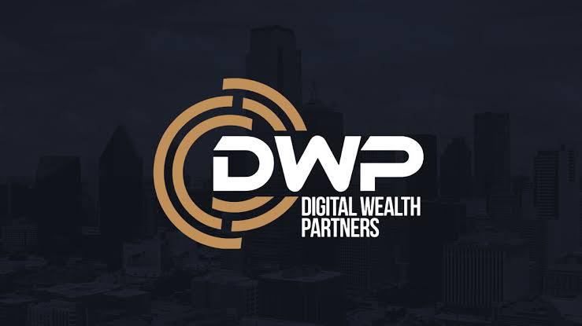

<p align="center">
  <a href="https://dwpofficial.org">
    
  </a>
</p>

<h1 align="center">Digital Wealth Partners</h1>

<p align="center">
  <strong>Gateway to Digital Investments</strong><br/>
  Institutional-grade digital asset strategies for Family Offices, HNWIs, and RIAs.
</p>

<p align="center">
  <a href="https://dwpofficial.org">dwpofficial.org</a>
</p>

---

## Table of Contents

- [About the Platform](#about-the-platform)
- [Who It Is For](#who-it-is-for)
- [What You Can Do With It](#what-you-can-do-with-it)
- [Tech Stack](#tech-stack)
- [Architecture](#architecture)
- [Security](#security)
- [Getting Started](#getting-started)
- [Environment Variables](#environment-variables)
- [Scripts](#scripts)
- [Project Structure](#project-structure)
- [Deployment](#deployment)
- [Compliance & Disclaimers](#compliance--disclaimers)
- [License](#license)

---

## About the Platform

**Digital Wealth Partners (DWP)** is a Registered Investment Advisor (RIA) specializing in digital assets and alternative investments. This repository contains the full production web platform that powers [dwpofficial.org](https://dwpofficial.org) — the public-facing marketing site, the authenticated **client portal**, and the internal **admin console** used by the DWP advisory team.

The platform exists to solve a specific problem: bringing the operational standards expected by Family Offices, HNWIs, and other RIAs — KYC/AML, entity verification, custody, reporting, and approval workflows — to the cryptocurrency and blockchain-asset space, where most consumer-grade tools fall short of those expectations.

### Purpose

- **Educate** prospects on DWP's services, custody model, and team through clear, content-rich public pages (Home, About, Services, Digital Asset Custody, Blog).
- **Onboard** new clients through three structured applications:
  - **Secured Wallet** sign-up (vault name, purpose, estimated assets, connected wallet).
  - **Digital Asset LLC** application (legal entity formation for asset segregation and tax planning).
  - **Combined** wallet + LLC track for clients who need both in one flow.
- **Operate** day-to-day client activity in an authenticated dashboard: viewing balances, requesting deposits and withdrawals across multiple chains (BTC, ETH, USDT on ETH/TRX/SOL, SOL, XRP, XLM, ADA, HBAR, TRX, DOGE), and tracking on-chain transaction history.
- **Administer** client accounts through a separate admin area where DWP staff review applications, approve or reject deposit and withdrawal requests, adjust balances, and manage deposit addresses + QR codes per asset.

## Who It Is For

| Audience       | What the platform does for them                                                                                                                       |
| -------------- | ----------------------------------------------------------------------------------------------------------------------------------------------------- |
| Family Offices | A regulated, RIA-led pathway into digital assets with custody, reporting, and entity structures (LLC formation) that match traditional-finance norms. |
| HNWIs          | Tailored portfolio strategies, curated investment opportunities, and a private dashboard for managing holdings and transactions.                      |
| Other RIAs     | A turnkey digital-asset capability they can extend to their own clients without building infrastructure in-house.                                     |
| DWP staff      | An admin console for reviewing applications, approving requests, and maintaining the integrity of client balances and deposit addresses.              |

## What You Can Do With It

### Public site

- Browse services, custody offering, team profiles, and the editorial blog.
- Submit a custody consultation inquiry routed to the DWP team mailbox.

### Client portal (`/dashboard`)

- View per-asset balances and unified portfolio totals.
- Request deposits — the platform shows a per-asset address and QR code; the request lands in the admin queue and only credits the user's balance after staff approval and on-chain confirmation.
- Request withdrawals — withdrawals respect a configurable per-user limit and require admin approval.
- Review a paginated transaction history (deposits, withdrawals, status).

### Admin console (`/admin`)

- Approve / reject deposit and withdrawal requests.
- Record manual deposits and adjust balances (with audit trail).
- Manage the deposit-address book and uploaded QR images per asset.
- Create, update, and delete user accounts.

## Tech Stack

- **Framework**: [Next.js 15](https://nextjs.org) (App Router, static export)
- **UI**: React 19, Tailwind CSS, Framer Motion
- **Auth & data**: [Supabase](https://supabase.com) — Postgres with Row-Level Security, Auth, and Edge Functions
- **Wallet integration**: RainbowKit + wagmi + viem (WalletConnect)
- **Forms & validation**: react-hook-form + Zod
- **Transactional email**: Resend
- **Language**: TypeScript (strict)
- **Hosting**: cPanel static hosting (OrangeHost), deployed via GitHub Actions → Git Version Control

## Architecture

```
┌──────────────────────────────┐         ┌────────────────────────────────────────┐
│  Next.js static export       │         │  Supabase                              │
│  (HTML/JS/CSS served by      │ ──────► │  ├─ Postgres (profiles, applications,  │
│   cPanel from public_html)   │         │  │   deposits, withdrawals)            │
│                              │         │  ├─ Auth (email/password, RLS-scoped)  │
│  Browser-side:               │         │  └─ Edge Functions (TypeScript / Deno) │
│   - public site              │         │      ├─ signup-application             │
│   - dashboard (client auth)  │         │      ├─ custody-inquiry                │
│   - admin (role-gated)       │         │      ├─ user-request-deposit /         │
│                              │         │      │   user-request-withdrawal       │
│                              │         │      └─ admin-* (10 endpoints)         │
└──────────────────────────────┘         └────────────────────────────────────────┘
```

- The site is built as a **static export** — no Node server in production. All dynamic behavior happens client-side against Supabase.
- Privileged operations (admin actions, signup writes, custody inquiries) run in **Supabase Edge Functions** that hold the service-role key. The browser never sees it.
- Row-Level Security on every table enforces that a logged-in user can only read or modify their own rows.

## Security

Security is treated as a first-class concern given the platform's audience and the sensitivity of digital asset holdings.

### Authentication & session management

- **Supabase Auth** (email + password) with sessions stored in HTTP-only cookies via `@supabase/ssr`.
- Email confirmation is disabled at the auth layer because account creation goes through a server-side Edge Function (`signup-application`) that uses `admin.createUser` — the function validates the entire signup payload before any user record exists.
- The dashboard's `<ApplicationShell />` redirects unauthenticated visitors to `/login`; the admin area additionally checks a server-verified admin role.

### Authorization

- **Row-Level Security (RLS)** is enabled on every table (`profiles`, `wallet_applications`, `llc_applications`, deposits, withdrawals, balances, deposit_requests, addresses). Policies are owner-scoped via `auth.uid() = user_id`, so a leaked anon key cannot read another user's data.
- Admin-only mutations (approve / reject / set balance / manage addresses) live exclusively in **Edge Functions** that verify the caller's admin role server-side before touching the database with the service-role key.

### Secrets handling

- The `SUPABASE_SERVICE_ROLE_KEY` is **never** shipped to the browser, embedded in the static build, or stored in GitHub Actions secrets. It lives only in:
  - Supabase Edge Function secrets (`supabase secrets set ...`).
  - The developer's local `.env.local` (gitignored).
- Only `NEXT_PUBLIC_*` keys (anon Supabase key, WalletConnect project ID) are exposed to the client — that is the documented Supabase pattern, and RLS is the line of defense behind them.

### CORS & abuse mitigation

- Edge Functions enforce a strict **CORS origin allowlist** (`dwpofficial.org`, `www.dwpofficial.org`, `dwpofficial.net`, `www.dwpofficial.net`, plus localhost in dev) — cross-origin calls from arbitrary domains are rejected.
- Forms use Zod-based input validation on both the client and inside the Edge Function before any DB write.

### Wallet integration

- Wallet connections are **read-only signatures** via WalletConnect / RainbowKit — DWP never receives, stores, or touches a user's private key or seed phrase. The custody page explicitly states: *"no seed phrases handled by anyone but you."*

### Custody-side controls

- Deposits are credited to a user's balance **only after** an admin reviews the request and confirms the on-chain transaction.
- Withdrawals require **admin approval** and are constrained by a per-user withdrawal limit.
- All deposit and withdrawal state changes are tracked with timestamps and status fields for an auditable trail.

### Transport & infrastructure

- HTTPS-only in production (cPanel-issued AutoSSL on the document root).
- Static export means the production surface area is just HTML/JS/CSS — no Node runtime to attack.
- Database access from the public is mediated entirely through the Supabase API gateway with RLS enforcement.

### Reporting a vulnerability

If you believe you've found a security issue, please email <security@dwpofficial.net> with reproduction steps. Do not open a public GitHub issue.

## Getting Started

### Prerequisites

- Node.js 20+ and npm
- A Supabase project (URL + anon key + service-role key) — see [supabase/migrations](supabase/migrations/) for the schema
- A WalletConnect Cloud project ID
- A Resend API key (only needed if you want transactional email locally)

### Install & run

```bash
git clone https://github.com/pa33honester/dwp-official.git
cd dwp-official

npm install

cp .env.local.example .env.local
# fill in the values described below

npm run dev
```

Open [http://localhost:3000](http://localhost:3000).

### Database setup

```bash
# Link your local CLI to the Supabase project
supabase link --project-ref <your-project-ref>

# Apply migrations
supabase db push

# Deploy Edge Functions
supabase functions deploy signup-application
supabase functions deploy custody-inquiry
# ...repeat for each function in supabase/functions/
```

## Environment Variables

`.env.local` is **never committed**. The template lives in [.env.local.example](.env.local.example).

| Variable                               | Where           | Purpose                                                        |
| -------------------------------------- | --------------- | -------------------------------------------------------------- |
| `NEXT_PUBLIC_SUPABASE_URL`             | client + server | Public Supabase project URL                                    |
| `NEXT_PUBLIC_SUPABASE_ANON_KEY`        | client + server | Public anon key — safe to expose; RLS enforces access          |
| `SUPABASE_SERVICE_ROLE_KEY`            | server only     | Bypasses RLS; used exclusively in Edge Functions               |
| `RESEND_API_KEY`                       | server only     | Transactional email sender                                     |
| `RESEND_FROM_EMAIL`                    | server only     | Verified sender address (e.g. `DWP <noreply@dwpofficial.net>`) |
| `NEXT_PUBLIC_WALLETCONNECT_PROJECT_ID` | client          | WalletConnect Cloud project ID for RainbowKit                  |

## Scripts

| Command             | Purpose                          |
| ------------------- | -------------------------------- |
| `npm run dev`       | Start the Next.js dev server     |
| `npm run build`     | Production build (static export) |
| `npm run start`     | Serve the production build       |
| `npm run lint`      | ESLint                           |
| `npm run typecheck` | TypeScript with no emit          |

## Project Structure

```
app/                          # Next.js App Router
  ├─ page.tsx                 # Landing
  ├─ about-us/                # Team & company
  ├─ services/                # Service pillars
  ├─ digital-asset-custody/   # Custody offering + inquiry form
  ├─ blog/                    # Editorial articles
  ├─ signup/{wallet,llc,both} # Onboarding flows
  ├─ login/                   # Auth
  ├─ dashboard/               # Client portal (balances, deposits, withdrawals)
  ├─ admin/                   # Internal admin console
  └─ profile/                 # User profile

components/                   # Header, Footer, Hero, forms, ApplicationShell, etc.
lib/                          # Supabase clients, team data, explorer URLs, helpers
public/                       # dwp-logo.jpeg, team/, blog/ images
supabase/
  ├─ migrations/              # 0001_init.sql → 0008_deposit_requests.sql
  └─ functions/               # Edge Functions (signup, deposits, withdrawals, admin)
```

## Deployment

Production: **[dwpofficial.org](https://dwpofficial.org)**

Pipeline:

1. Push to `master` triggers a GitHub Actions workflow that builds the Next.js static export.
2. The workflow writes a `.cpanel.yml` and pushes `out/` to a `deploy` branch.
3. An operator clicks **Update from Remote** → **Deploy HEAD Commit** in cPanel's Git Version Control UI; the server-side `cp` task copies the built files into `public_html`.

Supabase migrations and Edge Functions are deployed separately via the Supabase CLI.

## Compliance & Disclaimers

Digital Wealth Partners is a Registered Investment Advisor. Nothing in this repository, the deployed site, or any associated material constitutes individualized investment advice. Investing in digital assets involves substantial risk including the risk of loss. Past performance is not indicative of future results. The platform's onboarding flows collect personal and financial information for KYC/AML purposes consistent with applicable regulations.

## License

Proprietary — © Digital Wealth Partners. All rights reserved. Unauthorized copying, redistribution, or use of this code or its assets is prohibited.
